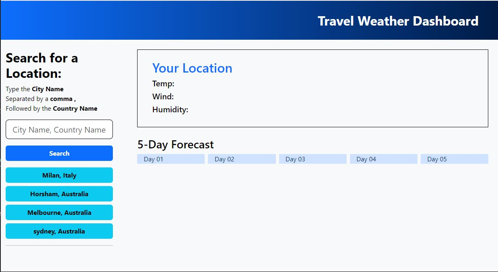

# TravelWeatherDashboard
This web app will allow you to view the 5 day weather forecast of any city

## Description
This web application will allow you to view teh weather of any city in the world.
It will give you todays temperature, wind, humidity as well as the next 5 days.
Your searches will be saved, and can be accessed easily via a button. 


## Technologies

- Git Hub
- Html
- Css
- Javascript
- Evan Hahn's ISO 3166 country list
- Open Weather Map Api 2.5
- Bootstrap v5.3.2
- Google Api Fonts

This application was an activity in allowing me to explore the application server side api's

## Visuals



## Installation

Website has been deployed and is available from this link:

[Travel Weather Dashboard](https://alexandranel.github.io/TravelWeatherDashboard/)

Full repository can be accessed here:

[Git Repository](https://github.com/AlexandraNel/TravelWeatherDashboard)

``````
To view repo contents please navigate to the above link there you will find
- assets folder
    - jpg
    - License
    - Favicon
    - script.js
    - style.css
- README.md
- index.html

``````

## Usage

This website was constructed in an effort to improve jquery and dayjs knowledge
Its usage is of a simple 9-5, daily scheduler.

## Support

If you come into any issues with this web application please contact
info@alexandranel.com

## Roadmap

Moving forward the following improvements can be made

- Design can be imrpoved by extending the css stylesheets
- Daily tasks can be saved to a server in order to retrieve yearly progress reports

## Authors and Acknowledgment

This website was made under the guidance and with assistance from
- the team at MONASH UNI full Stack Dev Bootcamp
- Instructor Chee Ho Tai
- TA Pranita Shrestha
- Tutor Weng Fei Fung 

## Licence
MIT License
